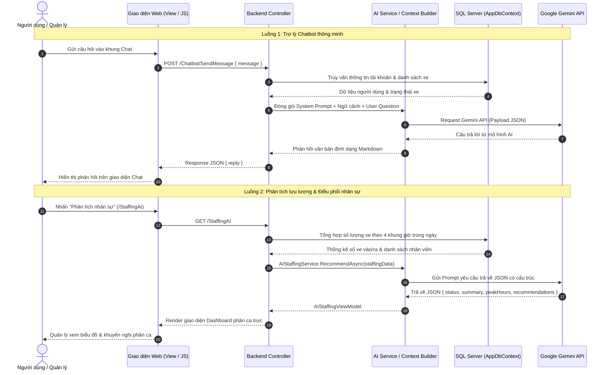

# TÀI LIỆU NHẬT KÝ VÀ ĐẶC TẢ TÍCH HỢP AI (AI LOG & INTEGRATION SPEC)
## HỆ THỐNG QUẢN LÝ BÃI XE CÓ TÍCH HỢP AI

---

## 1. TỔNG QUAN VỀ TÍCH HỢP AI

Hệ thống ứng dụng công nghệ Trí tuệ Nhân tạo thông qua dịch vụ **Google Gemini API** (`gemini-1.5-flash` / `gemini-2.5-flash`) nhằm nâng cao trải nghiệm người dùng và hỗ trợ quyết định quản lý bãi xe:

1. **Trợ lý Chatbot thông minh 24/7 (`ChatbotController`):** Tự động nhận diện vai trò người dùng (Khách hàng, Nhân viên, Quản lý), tích hợp thông tin xe thực tế từ CSDL vào ngữ cảnh (Context Injection) để trả lời thắc mắc về cước phí, quy định, mất vé và gia hạn vé tháng.
2. **AI Phân tích lưu lượng & Điều phối nhân sự (`AIStaffingService` & `AIAnalysisService`):** Khai thác dữ liệu lịch sử lượt xe gửi theo khung giờ để phát hiện khung giờ cao điểm (Peak Hours) và đề xuất số lượng nhân viên trực tối ưu tại các cổng.

---

## 2. KIẾN TRÚC KẾT NỐI VÀ LUỒNG DỮ LIỆU AI



---

## 3. BẢNG NHẬT KÝ PROMPT ENGINEERING (PROMPT LOG)

Bảng ghi chép lại quá trình thử nghiệm, tối ưu hóa câu lệnh (System Prompt) và kết quả tương tác với mô hình Gemini AI:

### Log 01: Chatbot tư vấn quy chế & bảng giá gửi xe

| Thông tin | Nội dung chi tiết |
| :--- | :--- |
| **Mã thử nghiệm** | `PROMPT-LOG-01` |
| **Dịch vụ / Tính năng** | Chatbot hỗ trợ khách hàng (`ChatbotController`) |
| **Mô hình AI** | `gemini-1.5-flash` / `gemini-2.5-flash` |
| **Vai trò người dùng** | `KhachHang` |
| **System Instruction** | *"Bạn là trợ lý AI thông minh của bãi đỗ xe thông minh. Hãy giải đáp thân thiện, chính xác dựa trên bảng giá: Xe máy 5.000đ/lượt ban ngày, qua đêm 10.000đ. Ô tô 20.000đ/lượt, qua đêm 50.000đ. Vé tháng xe máy 100.000đ, ô tô 1.000.000đ. Chỉ trả lời trong phạm vi quy chế bãi xe, không bịa đặt."* |
| **Câu hỏi người dùng (Input)** | *"Mình gửi xe máy từ 14h chiều đến 8h sáng hôm sau thì hết bao nhiêu tiền?"* |
| **Kết quả phản hồi (Output)** | *"Chào bạn! Xe của bạn gửi qua đêm (từ chiều hôm trước đến sáng hôm sau) nên cước phí sẽ áp dụng biểu phí qua đêm đối với xe máy là **10.000 VNĐ**. Nếu bạn có vé tháng còn hạn, cước gửi lượt sẽ là **0 VNĐ** nhé!"* |
| **Đánh giá** | Phản hồi chính xác mức phí qua đêm, tính toán đúng nghiệp vụ bãi xe, có thêm thông tin vé tháng hữu ích. |

---

### Log 02: Hướng dẫn xử lý sự cố mất vé xe

| Thông tin | Nội dung chi tiết |
| :--- | :--- |
| **Mã thử nghiệm** | `PROMPT-LOG-02` |
| **Dịch vụ / Tính năng** | Chatbot hỗ trợ nhân viên / khách hàng |
| **Mô hình AI** | `gemini-1.5-flash` |
| **Vai trò người dùng** | `KhachHang` |
| **Câu hỏi người dùng (Input)** | *"Tôi lỡ làm mất thẻ gửi xe máy rồi, bây giờ phải làm sao để lấy xe?"* |
| **Kết quả phản hồi (Output)** | *"Rất tiếc về sự cố của bạn. Để lấy xe khi mất vé, bạn vui lòng thực hiện theo các bước sau:<br>1. Đến bốt trực gặp nhân viên bãi xe.<br>2. Xuất trình CCCD/CMND và Giấy đăng ký xe (cà vẹt xe) trùng khớp với biển số xe đang gửi.<br>3. Nhân viên sẽ lập biên bản xử lý mất vé.<br>4. Khoản phí cần thanh toán bao gồm: Tiền gửi xe thực tế + Phụ phí mất thẻ xe máy là **50.000 VNĐ**.<br>Sau khi đối soát đúng biển số và thanh toán, bạn sẽ được nhận lại xe an toàn."* |
| **Đánh giá** | Nêu đầy đủ giấy tờ cần thiết, mức phụ thu đúng quy tắc nghiệp vụ BR-04. |

---

### Log 03: AI Phân tích lưu lượng & Đề xuất ca trực nhân sự

| Thông tin | Nội dung chi tiết |
| :--- | :--- |
| **Mã thử nghiệm** | `PROMPT-LOG-03` |
| **Dịch vụ / Tính năng** | AI Phân tích điều phối nhân sự (`AIStaffingService`) |
| **Mô hình AI** | `gemini-2.5-flash` |
| **Dữ liệu đầu vào (JSON Payload)** | `{"totalVehiclesToday": 420, "hourlyTraffic": [{"hourRange": "00:00 - 06:00", "vehicleCount": 15}, {"hourRange": "06:00 - 12:00", "vehicleCount": 210}, {"hourRange": "12:00 - 18:00", "vehicleCount": 135}, {"hourRange": "18:00 - 24:00", "vehicleCount": 60}], "availableStaffCount": 5}` |
| **Yêu cầu cấu trúc đầu ra** | Trả về định dạng JSON thuần túy (Structured JSON): `status`, `summary`, `peakHours`, `recommendations`. |
| **Kết quả AI trả về** | ```json
{
  "status": "success",
  "summary": "Tổng số lượng xe trong ngày là 420 lượt. Lưu lượng tập trung cao nhất vào buổi sáng từ 06:00 đến 12:00 (chiếm 50% tổng lưu lượng trong ngày).",
  "peakHours": ["06:00 - 12:00 (210 xe)", "12:00 - 18:00 (135 xe)"],
  "recommendations": [
    "Ca sáng (06:00 - 12:00): Bố trí 3 nhân viên (2 nhân viên tại cổng vào để tránh ùn tắc đầu giờ làm, 1 nhân viên tuần tra).",
    "Ca chiều (12:00 - 18:00): Duy trì 2 nhân viên (1 nhân viên trực cổng ra, 1 nhân viên hỗ trợ vé tháng).",
    "Ca đêm (18:00 - 06:00): Bố trí 1 nhân viên trực chốt an ninh do lưu lượng xe thấp."
  ]
}
``` |
| **Đánh giá** | Tuân thủ chính xác ràng buộc tổng số nhân viên (<= 5 người), phát hiện đúng khung giờ cao điểm và phân bổ ca trực khoa học. |

---

## 4. BẢO MẬT & QUY TẮC AN TOÀN TRONG PROMPT (AI SAFETY & GUARDRAILS)

Hệ thống cài đặt các rào chắn kỹ thuật (Guardrails) nghiêm ngặt trong mã nguồn:

1. **Không thay đổi CSDL tự động:** AI không có quyền cập nhật, xóa hoặc ghi trực tiếp vào cơ sở dữ liệu. Mọi đề xuất của AI chỉ hiển thị trên giao diện người dùng để người quản lý phê duyệt.
2. **Không bịa đặt số liệu (Hallucination Prevention):** System Prompt ép buộc mô hình chỉ dựa trên dữ liệu JSON được hệ thống cung cấp; nếu không đủ số liệu phải thông báo rõ.
3. **Bảo mật khóa API:** Khóa `Gemini:ApiKey` được lưu trữ ở file cấu hình máy chủ (`.env` / `appsettings.json`), hoàn toàn độc lập và không bao giờ gửi về phía client JavaScript.
4. **Phân tách ngữ cảnh người dùng:** Khách hàng không thể tra cứu thông tin lượt xe hoặc doanh thu của người khác qua Chatbot.

---

## 5. THIẾT KẾ ĐỀ XUẤT CHO BẢNG CSDL `AILog` (NÂNG CẤP TƯƠNG LAI)

Để lưu trữ toàn bộ lịch sử hỏi - đáp AI trong cơ sở dữ liệu phục vụ đối soát và phân tích chất lượng, dưới đây là đề xuất cấu trúc bảng `AILogs`:

### 5.1. Định nghĩa C# Model (`AILog.cs`)
```csharp
namespace QuanLyBaiXe.Models
{
    public class AILog
    {
        public int Id { get; set; }
        public string? Username { get; set; }
        public string UserRole { get; set; } = string.Empty;
        public string FeatureName { get; set; } = string.Empty; // "Chatbot" hoặc "StaffingAI"
        public string PromptText { get; set; } = string.Empty;
        public string ResponseText { get; set; } = string.Empty;
        public int ResponseTimeMs { get; set; }
        public bool IsSuccess { get; set; } = true;
        public string? ErrorMessage { get; set; }
        public DateTime CreatedAt { get; set; } = DateTime.Now;
    }
}
```

### 5.2. Cấu trúc bảng SQL Server
```sql
CREATE TABLE [dbo].[AILogs] (
    [Id] INT IDENTITY(1,1) NOT NULL PRIMARY KEY,
    [Username] NVARCHAR(50) NULL,
    [UserRole] NVARCHAR(50) NOT NULL,
    [FeatureName] NVARCHAR(50) NOT NULL,
    [PromptText] NVARCHAR(MAX) NOT NULL,
    [ResponseText] NVARCHAR(MAX) NOT NULL,
    [ResponseTimeMs] INT NOT NULL,
    [IsSuccess] BIT NOT NULL DEFAULT 1,
    [ErrorMessage] NVARCHAR(500) NULL,
    [CreatedAt] DATETIME2 NOT NULL DEFAULT GETDATE()
);

CREATE NONCLUSTERED INDEX [IX_AILogs_FeatureName_CreatedAt] 
ON [dbo].[AILogs] ([FeatureName], [CreatedAt]);
```
