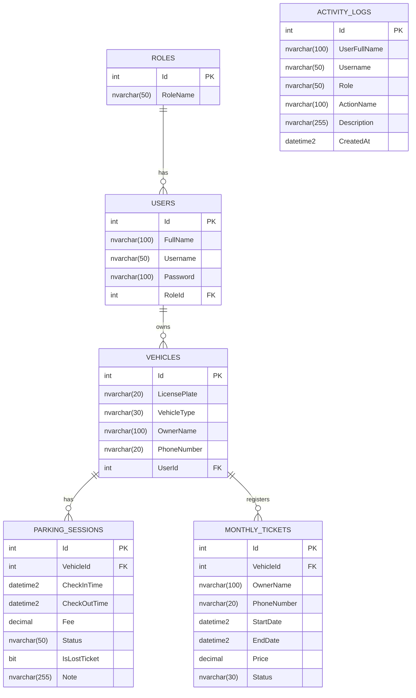

# TÀI LIỆU THIẾT KẾ CƠ SỞ DỮ LIỆU (DATABASE DESIGN)
## HỆ THỐNG QUẢN LÝ BÃI XE CÓ TÍCH HỢP AI

---

## 1. TỔNG QUAN HỆ CƠ SỞ DỮ LIỆU

Hệ thống quản lý bãi xe sử dụng hệ quản trị cơ sở dữ liệu quan hệ **Microsoft SQL Server**, tương tác thông qua ORM **Entity Framework Core (Code-First)**. Cơ sở dữ liệu được thiết kế nhằm đảm bảo tính toàn vẹn dữ liệu, tốc độ truy vấn cao tại cổng kiểm soát và khả năng lưu vết chi tiết mọi hoạt động.

---

## 2. SƠ ĐỒ THỰC THỂ - QUAN HỆ (ERD - ENTITY RELATIONSHIP DIAGRAM)

---

## 3. TỪ ĐIỂN DỮ LIỆU CHI TIẾT (DATA DICTIONARY)

### 3.1. Bảng `Roles` (Vai trò người dùng)
Lưu trữ danh mục vai trò phân quyền trong hệ thống.

| Tên trường | Kiểu dữ liệu | Null | Khóa | Giá trị mặc định | Mô tả |
| :--- | :--- | :---: | :---: | :--- | :--- |
| `Id` | `int` | No | **PK** | Identity (1,1) | Mã định danh vai trò |
| `RoleName` | `nvarchar(50)` | No | | | Tên vai trò (`QuanLy`, `NhanVien`, `KhachHang`) |

*Dữ liệu khởi tạo (Seed Data):*
- `Id = 1`: `QuanLy` (Quản trị viên)
- `Id = 2`: `NhanVien` (Nhân viên bãi xe)
- `Id = 3`: `KhachHang` (Khách hàng gửi xe)

---

### 3.2. Bảng `Users` (Người dùng)
Lưu trữ thông tin tài khoản đăng nhập của cán bộ quản lý, nhân viên soát vé và khách hàng.

| Tên trường | Kiểu dữ liệu | Null | Khóa | Giá trị mặc định | Mô tả |
| :--- | :--- | :---: | :---: | :--- | :--- |
| `Id` | `int` | No | **PK** | Identity (1,1) | Mã tài khoản |
| `FullName` | `nvarchar(100)`| No | | | Họ và tên đầy đủ của người dùng |
| `Username` | `nvarchar(50)` | No | **Unique** | | Tên đăng nhập vào hệ thống |
| `Password` | `nvarchar(100)`| No | | | Mật khẩu tài khoản |
| `RoleId` | `int` | No | **FK** | | Khóa ngoại tham chiếu đến `Roles(Id)` |

---

### 3.3. Bảng `Vehicles` (Phương tiện)
Lưu trữ danh sách phương tiện đã từng vào bãi hoặc được khách hàng đăng ký.

| Tên trường | Kiểu dữ liệu | Null | Khóa | Giá trị mặc định | Mô tả |
| :--- | :--- | :---: | :---: | :--- | :--- |
| `Id` | `int` | No | **PK** | Identity (1,1) | Mã phương tiện |
| `LicensePlate`| `nvarchar(20)`| No | **Index**| | Biển số xe (Ví dụ: `29A-123.45`, `20B1-9999`) |
| `VehicleType` | `nvarchar(30)`| No | | | Loại phương tiện (`Xe máy`, `Ô tô`) |
| `OwnerName` | `nvarchar(100)`| Yes | | NULL | Tên chủ sở hữu phương tiện (nếu có) |
| `PhoneNumber` | `nvarchar(20)` | Yes | | NULL | Số điện thoại liên hệ chủ xe |
| `UserId` | `int` | Yes | **FK** | NULL | Tham chiếu `Users(Id)` nếu xe thuộc khách hàng có tài khoản |

---

### 3.4. Bảng `ParkingSessions` (Phiên gửi xe / Lượt xe)
Lưu trữ lịch sử chi tiết từng lượt vào và ra của phương tiện.

| Tên trường | Kiểu dữ liệu | Null | Khóa | Giá trị mặc định | Mô tả |
| :--- | :--- | :---: | :---: | :--- | :--- |
| `Id` | `int` | No | **PK** | Identity (1,1) | Mã phiên gửi xe |
| `VehicleId` | `int` | No | **FK** | | Mã phương tiện tham chiếu `Vehicles(Id)` |
| `CheckInTime` | `datetime2` | No | **Index**| | Thời điểm xe vào bãi |
| `CheckOutTime`| `datetime2` | Yes | | NULL | Thời điểm xe ra bãi và thanh toán |
| `Fee` | `decimal(18,2)`| Yes| | NULL | Cước phí gửi xe thực thu (VNĐ) |
| `Status` | `nvarchar(50)`| No | **Index**| `'DangGui'` | Trạng thái lượt gửi (`DangGui`, `DaThanhToan`) |
| `IsLostTicket`| `bit` | No | | `0` (false) | Cờ đánh dấu lượt xe có bị mất vé hay không |
| `Note` | `nvarchar(255)`| Yes| | NULL | Ghi chú thêm (biên bản mất thẻ, tình trạng xe...) |

---

### 3.5. Bảng `MonthlyTickets` (Vé tháng)
Lưu trữ thông tin vé gửi xe định kỳ hàng tháng của khách hàng thường xuyên.

| Tên trường | Kiểu dữ liệu | Null | Khóa | Giá trị mặc định | Mô tả |
| :--- | :--- | :---: | :---: | :--- | :--- |
| `Id` | `int` | No | **PK** | Identity (1,1) | Mã thẻ vé tháng |
| `VehicleId` | `int` | No | **FK** | | Mã phương tiện tham chiếu `Vehicles(Id)` |
| `OwnerName` | `nvarchar(100)`| No | | | Họ tên chủ thẻ đăng ký vé tháng |
| `PhoneNumber` | `nvarchar(20)` | No | | | Số điện thoại liên lạc chủ thẻ |
| `StartDate` | `datetime2` | No | | | Ngày vé bắt đầu có hiệu lực |
| `EndDate` | `datetime2` | No | **Index**| | Ngày vé hết hạn sử dụng |
| `Price` | `decimal(18,2)`| No | | | Giá tiền mua hoặc gia hạn vé tháng |
| `Status` | `nvarchar(30)`| No | | `'ConHan'` | Trạng thái hiệu lực (`ConHan`, `HetHan`) |

---

### 3.6. Bảng `ActivityLogs` (Nhật ký hoạt động hệ thống)
Ghi nhận mọi thao tác mang tính nghiệp vụ và an ninh bãi xe.

| Tên trường | Kiểu dữ liệu | Null | Khóa | Giá trị mặc định | Mô tả |
| :--- | :--- | :---: | :---: | :--- | :--- |
| `Id` | `int` | No | **PK** | Identity (1,1) | Mã bản ghi log |
| `UserFullName`| `nvarchar(100)`| No | | `''` | Họ tên của người thực hiện thao tác |
| `Username` | `nvarchar(50)` | No | | `''` | Tài khoản đăng nhập thực hiện |
| `Role` | `nvarchar(50)` | No | | `''` | Vai trò của tài khoản lúc thực hiện (`QuanLy`, `NhanVien`...) |
| `ActionName` | `nvarchar(100)`| No | | `''` | Tên hành động (`CheckIn`, `CheckOut`, `LostTicket`, `RenewTicket`...) |
| `Description` | `nvarchar(255)`| No | | `''` | Mô tả chi tiết nội dung thay đổi |
| `CreatedAt` | `datetime2` | No | **Index**| `DateTime.Now` | Thời điểm phát sinh hành động |

---

## 4. CHIẾN LƯỢC TỐI ƯU HÓA VÀ ĐÁNH CHỈ MỤC (INDEXING)

Để đảm bảo thời gian quét xe vào/ra dưới **1 giây**, các Index sau được khuyến nghị áp dụng:

1. **`IX_Vehicles_LicensePlate` (Non-Clustered):** Đánh chỉ mục trên cột `LicensePlate` của bảng `Vehicles` để tăng tốc độ tìm kiếm xe theo biển số khi Check-in / Check-out.
2. **`IX_ParkingSessions_Status_VehicleId` (Composite Index):** Đánh chỉ mục kết hợp giữa `Status` và `VehicleId` để hệ thống kiểm tra ngay lập tức xem phương tiện có phiên nào đang ở trạng thái `DangGui` hay không.
3. **`IX_ParkingSessions_CheckInTime`:** Tối ưu hóa truy vấn báo cáo doanh thu và tổng hợp lưu lượng theo khung giờ phục vụ dịch vụ AI.
4. **`IX_MonthlyTickets_VehicleId_EndDate`:** Kiểm tra nhanh chóng điều kiện miễn phí lượt gửi cho các xe có vé tháng hợp lệ.
