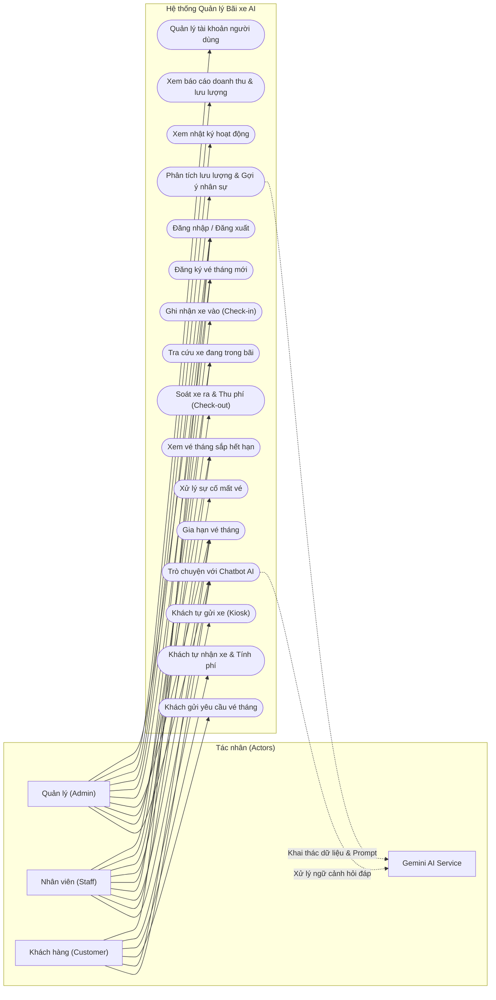

# TÀI LIỆU ĐẶC TẢ VÀ SƠ ĐỒ USE CASE
## HỆ THỐNG QUẢN LÝ BÃI XE CÓ TÍCH HỢP AI

---

## 1. TỔNG QUAN TÁC NHÂN (ACTORS)

1. **Quản trị viên (Admin - `QuanLy`):** Người điều hành toàn bộ hoạt động của bãi đỗ xe, có toàn quyền quản trị tài khoản, vé xe, thống kê tài chính và sử dụng tính năng điều phối AI.
2. **Nhân viên bãi xe (`NhanVien`):** Phụ trách trực chốt tại các cổng kiểm soát xe vào/ra, thực hiện soát vé, thu cước và lập biên bản xử lý sự cố mất vé.
3. **Khách gửi xe (`KhachHang`):** Khách hàng sử dụng dịch vụ gửi xe, thực hiện tự check-in/out tại kiosk, đăng ký và gia hạn vé tháng online, hoặc trò chuyện với trợ lý Chatbot AI.
4. **Hệ thống AI (Google Gemini API):** Tác nhân phụ hỗ trợ xử lý ngôn ngữ tự nhiên và phân tích dữ liệu lưu lượng xe.

---

## 2. SƠ ĐỒ USE CASE TỔNG QUAN (USE CASE DIAGRAM)

---

## 3. BẢNG DANH MỤC USE CASE

| Mã UC | Tên Use Case | Tác nhân chính | Mục tiêu |
| :--- | :--- | :--- | :--- |
| **UC-01** | Đăng nhập / Đăng xuất | `QuanLy`, `NhanVien`, `KhachHang` | Xác thực danh tính và phân quyền truy cập chức năng tương ứng |
| **UC-02** | Soát xe vào (Check-in) | `NhanVien` | Ghi nhận phương tiện vào bãi và tạo phiên gửi xe mới |
| **UC-03** | Soát xe ra & Thu phí (Check-out) | `NhanVien` | Kiểm tra xe ra, tính cước gửi xe và hoàn tất phiên gửi xe |
| **UC-04** | Khách tự gửi xe (Kiosk) | `KhachHang` | Khách tự nhập biển số nhận chỗ gửi xe tại trạm tự phục vụ |
| **UC-05** | Khách tự nhận xe (Kiosk) | `KhachHang` | Khách tra cứu và hiển thị hóa đơn tính cước gửi xe của mình |
| **UC-06** | Xử lý mất vé xe | `NhanVien` | Lập biên bản mất vé, áp dụng phụ phí phạt và giải phóng xe |
| **UC-07** | Đăng ký vé tháng | `QuanLy`, `NhanVien` | Cấp thẻ vé tháng cho phương tiện thường xuyên gửi |
| **UC-08** | Khách đăng ký vé tháng online | `KhachHang` | Khách tự đăng ký thông tin vé tháng gắn liền với tài khoản |
| **UC-09** | Gia hạn vé tháng | `QuanLy`, `NhanVien`, `KhachHang` | Gia hạn thêm thời hạn hiệu lực (30 ngày) cho vé tháng |
| **UC-10** | Tra cứu xe & Cảnh báo hết hạn | `QuanLy`, `NhanVien` | Theo dõi các phương tiện trong bãi và vé sắp hết hạn (< 5 ngày) |
| **UC-11** | Quản lý người dùng | `QuanLy` | Thêm, sửa, xóa, phân quyền tài khoản quản trị và nhân viên |
| **UC-12** | Báo cáo doanh thu & Lưu lượng | `QuanLy` | Xem thống kê số tiền thu được và lượng xe theo các mốc thời gian |
| **UC-13** | Xem nhật ký hoạt động | `QuanLy` | Truy vết các thao tác quan trọng trong hệ thống để đối soát |
| **UC-14** | Phân tích & Gợi ý nhân sự bằng AI | `QuanLy` | AI phân tích dữ liệu gửi xe để đề xuất bố trí ca trực nhân viên |
| **UC-15** | Trò chuyện với Chatbot AI | `QuanLy`, `NhanVien`, `KhachHang` | Giải đáp thắc mắc về cước phí, quy chế và quy trình gửi xe 24/7 |

---

## 4. ĐẶC TẢ CHI TIẾT CÁC USE CASE TRỌNG TÂM

### 4.1. UC-02: Soát xe vào bãi (Check-in)
* **Tác nhân:** Nhân viên bãi xe (`NhanVien`).
* **Tiền điều kiện:** Nhân viên đã đăng nhập thành công vào hệ thống.
* **Hậu điều kiện:** Một bản ghi mới được tạo trong bảng `ParkingSessions` với trạng thái `DangGui`.
* **Luồng sự kiện chính (Main Flow):**
  1. Nhân viên truy cập chức năng **"Cho xe vào"**.
  2. Nhân viên nhập Biển số xe, chọn Loại xe (Xe máy / Ô tô), ghi chú (nếu có).
  3. Nhân viên nhấn nút **"Xác nhận xe vào"**.
  4. Hệ thống kiểm tra trong CSDL:
     - Nếu xe chưa có trong bảng `Vehicles`, hệ thống tự tạo mới thông tin xe.
     - Kiểm tra xe có đang ở trạng thái `DangGui` hay không.
  5. Hệ thống ghi nhận thời điểm vào (`CheckInTime = DateTime.Now`), trạng thái `Status = "DangGui"`.
  6. Hệ thống tự động ghi lại bản ghi nhật ký trong `ActivityLogs`.
  7. Hệ thống hiển thị thông báo Check-in thành công và in/cấp mã gửi xe cho khách.
* **Luồng ngoại lệ (Alternative Flow):**
  - *Biển số xe đang gửi trong bãi:* Hệ thống hiển thị thông báo lỗi "Xe có biển số này hiện đang đỗ trong bãi, không thể Check-in lại." và hủy tác vụ.
  - *Dữ liệu nhập không hợp lệ:* Hệ thống yêu cầu bổ sung biển số xe.

---

### 4.2. UC-03: Soát xe ra bãi & Thu tiền (Check-out)
* **Tác nhân:** Nhân viên bãi xe (`NhanVien`).
* **Tiền điều kiện:** Xe cần thanh toán đang có phiên gửi ở trạng thái `DangGui`.
* **Hậu điều kiện:** Phiên gửi chuyển trạng thái `DaThanhToan`, cập nhật thời gian ra và số tiền đã thanh toán.
* **Luồng sự kiện chính:**
  1. Nhân viên truy cập chức năng **"Cho xe ra"**.
  2. Nhân viên nhập hoặc quét Biển số xe cần ra bãi.
  3. Hệ thống tìm kiếm phiên gửi xe tương ứng đang có trạng thái `DangGui`.
  4. Hệ thống kiểm tra xem phương tiện có vé tháng (`MonthlyTickets`) còn hiệu lực hay không:
     - Nếu có vé tháng còn hạn: Cước phí tính là **0 VNĐ**.
     - Nếu không có vé tháng: Hệ thống tính phí theo quy tắc giờ/ngày dựa trên loại xe (Xe máy: 5.000 VNĐ; Ô tô: 20.000 VNĐ; gửi qua đêm nhân đôi).
  5. Hệ thống hiển thị thông tin thời gian gửi, thời gian ra dự kiến và tổng tiền cần thanh toán.
  6. Nhân viên thu tiền từ khách và bấm **"Xác nhận thanh toán & Cho xe ra"**.
  7. Hệ thống cập nhật `CheckOutTime = DateTime.Now`, `Status = "DaThanhToan"`, lưu số tiền vào `Fee`.
  8. Hệ thống ghi nhật ký vào `ActivityLogs` và mở barie cho xe ra.
* **Luồng ngoại lệ:**
  - *Không tìm thấy xe trong bãi:* Hệ thống thông báo "Không tìm thấy phiên gửi xe nào phù hợp với biển số này". Nhân viên có thể chuyển sang quy trình kiểm tra hoặc xử lý mất vé.

---

### 4.3. UC-06: Xử lý sự cố mất vé xe (Lost Ticket)
* **Tác nhân:** Nhân viên bãi xe (`NhanVien`).
* **Tiền điều kiện:** Khách hàng không xuất trình được vé/thẻ xe hợp lệ khi ra bãi.
* **Luồng sự kiện chính:**
  1. Nhân viên truy cập trang **"Xử lý mất vé"**.
  2. Nhân viên nhập biển số xe, số CCCD/Họ tên chủ xe và lý do giải trình.
  3. Hệ thống tra cứu phiên gửi xe đang tồn tại của xe.
  4. Hệ thống tính tổng tiền = Cước gửi thực tế + Phụ phí mất thẻ (50.000đ với xe máy / 100.000đ với ô tô).
  5. Nhân viên xác nhận khách hàng đã hoàn tất thủ tục cam kết và nộp đủ tiền.
  6. Hệ thống đánh dấu `IsLostTicket = true`, lưu ghi chú biên bản vào trường `Note`, cập nhật `Status = "DaThanhToan"`.
  7. Hệ thống ghi nhận biên bản mất vé vào `ActivityLogs`.

---

### 4.4. UC-14: Phân tích lưu lượng & Gợi ý nhân sự bằng AI (Staffing AI)
* **Tác nhân:** Quản trị viên (`QuanLy`), Hệ thống AI (Gemini).
* **Tiền điều kiện:** Quản trị viên đã đăng nhập và có dữ liệu lưu lượng xe trong CSDL.
* **Hậu điều kiện:** Báo cáo phân tích và bảng khuyến nghị nhân sự được hiển thị trên giao diện Dashboard.
* **Luồng sự kiện chính:**
  1. Quản lý chọn mục **"AI Điều phối nhân sự"** (`/StaffingAI`).
  2. Hệ thống tổng hợp dữ liệu lượt xe vào/ra theo từng khung giờ trong ngày (0h-6h, 6h-12h, 12h-18h, 18h-24h) và số lượng nhân viên hiện có.
  3. Hệ thống đóng gói dữ liệu thành payload JSON chuẩn và truyền cho `AIStaffingService`.
  4. Service gửi request kèm System Prompt phân tích nghiệp vụ bãi xe tới Google Gemini API.
  5. Gemini AI trả về kết quả định dạng JSON gồm: Tóm tắt lưu lượng, danh sách giờ cao điểm (Peak hours), khuyến nghị bố trí nhân lực cụ thể cho từng vị trí.
  6. Hệ thống render giao diện trực quan cho Quản lý gồm: Card cảnh báo khung giờ cao điểm, bảng phân ca trực đề xuất.
* **Luồng ngoại lệ:**
  - *Mất kết nối mạng hoặc lỗi API Key:* Hệ thống bắt ngoại lệ và hiển thị thông báo "Không thể kết nối dịch vụ Gemini AI. Vui lòng kiểm tra lại cấu hình API Key." mà không làm gián đoạn các chức năng khác của bãi xe.

---

### 4.5. UC-15: Trò chuyện với Chatbot AI
* **Tác nhân:** `KhachHang`, `NhanVien`, `QuanLy`.
* **Luồng sự kiện chính:**
  1. Người dùng bấm biểu tượng Chatbot nổi ở góc dưới màn hình.
  2. Người dùng nhập câu hỏi (ví dụ: *"Giá gửi xe qua đêm là bao nhiêu?"*, *"Làm sao để gia hạn vé tháng?"*, *"Xe của tôi gửi từ mấy giờ?"*).
  3. JavaScript gửi tin nhắn qua POST `/Chatbot/SendMessage`.
  4. `ChatbotController` thu thập ngữ cảnh tài khoản người dùng đang đăng nhập và các xe liên quan từ CSDL.
  5. Backend gắn System Prompt quy định rõ nghiệp vụ và gửi tới Gemini API.
  6. Chatbot hiển thị câu trả lời thông minh, đúng thẩm quyền và chuẩn quy chế của bãi đỗ xe.
